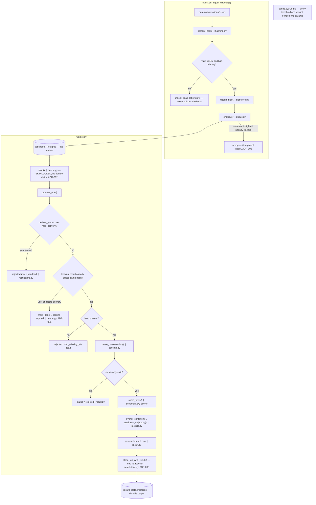

# NOTES

## Pipeline overview

One conversation's journey end to end — every step tagged with the file and
function that implements it, and the constraint it exists to satisfy.



**Files, in the order the diagram uses them**: `hashing.py` (the idempotency
key) → `blobstore.py` (the durable transcript) → `queue.py` (the claim,
`FOR UPDATE SKIP LOCKED`) → `worker.py` (the loop and `process_one`) →
`schema.py` (validate, keep the good turns, drop the bad ones) →
`sentiment.py` (the model, empty turns skipped) → `metrics.py` (the two
numbers, `null` ≠ `0.0`) → `result.py` (assemble the row) → `resultstore.py`
(persist, one transaction). `config.py` isn't a step — every threshold above
(`max_delivery`, the lease, `λ`, `τ`, `B`) is read from it and copied into
every result's `params`, so the diagram's decisions stay reproducible six
months later.

**Constraints visible in the shape of the diagram, not just its labels**:
work only leaves `claimed` by committing a transaction that also records the
outcome (a crash anywhere above `close_job_with_result` just gets retried);
every one of the three dead-ends (`ADL`, `REJ1`, `REJ2`, `REJ3`) still leaves
a durable record — nothing is ever silently dropped; and the two duplicate
checks (`A4`'s no-op, `D2`'s skip) are what make the `c-000002` /
`c-000002.duplicate.json` pair collapse into one result.

---

## 1. How to run it

Requires **Docker** (with Compose v2) and nothing else — no account, no API
key, no GPU.

```bash
docker compose build       # ~2-4 min first time: downloads a CPU-only
                            # PyTorch wheel (~190 MB) and the pinned
                            # sentiment model (~479 MB). Nothing is fetched
                            # at runtime after this.
docker compose up -d postgres
docker compose run --rm worker migrate
docker compose run --rm worker ingest data/conversations
docker compose run --rm worker run --once
docker compose run --rm worker results --summary
```

Or the whole sequence in one go: `bash scripts/smoke.sh`.

Expected, on the shipped 27-conversation sample set:
```
files_seen=28 enqueued=27 already_tracked=1 parse_errors=0
processed=27
scored: 21
partial: 1
rejected: 5
```

Scale it to see the queue boundary for real — two independent containers
claiming disjoint work from the same `jobs` table:
```bash
docker compose up -d --scale worker=2
```
(Verified: two containers split 27 jobs 16/11 with zero overlap.)

**Python 3.11**, Docker Compose v2. Safe to run unattended: no `sudo`, nothing
written outside the project, only Postgres's `5432` exposed, no TLS disabled,
no committed secrets (`sb`/`sb` in `docker-compose.yml` is a disposable local
credential with no external network exposure).

Local development without Docker for the app itself (Postgres still needs
Docker) is documented in `README.md`.

---

## 2. Metric definitions

Both are computed over **customer turns only**, in the order they appear in
the source array (not `seq` — see the trade-offs on `c-000021`). A turn with
no letters, digits, or emoji in it (blank, whitespace, `"..."`, `"?!?!"`)
carries no signal and is excluded from both — the deliberate `null` vs `0.0`
line runs through everything below.

### `overall_sentiment`

```
S = Σ(w_i · signed_i) / Σ w_i     where   w_i = exp(-λ·(n-1-i)) · confidence_i
```

Later turns and more-confident turns count for more. `n == 1` falls out of the
same formula with no special case. `λ = 0.5`, label thresholds `τ = ±0.15`,
both carried in the output's `params`.

- `n == 0` (no customer turn had a signal) → **`null`**. Not `0.0`.
- All-zero-confidence (never observed in practice, guarded anyway) → falls
  back to an unweighted mean rather than dividing by zero.

**Worked example** (angry → satisfied, `c-000002`-shaped): signed scores
`[-0.80, -0.60, 0.30, 0.90]`, confidences `[0.90, 0.80, 0.70, 0.95]` →
`S = +0.345` → **positive**. A plain mean of the same four numbers is `-0.05`
(reads as "slightly negative / neutral") — the recency weighting is what
correctly reports that the customer left happy.

### `sentiment_trajectory`

```
value = tanh(β / B)     where   β = OLS slope of signed score vs x_i = i/(n-1)
```

`x_i` is position **among the scored customer turns** (0 to 1), not the raw
turn index — an excluded turn is skipped, not a gap. Normalising to `[0, 1]`
is what makes a 5-turn and a 200-turn conversation with the same arc land on
the same number. `B = 2.0`. Confidence is **deliberately not used here** — the
slope is already a noisy estimator, and confidence-weighting it risks
distorting the one thing this metric must get right: direction.

- `n < 2` → **`null`** (a single point has no trajectory).
- `n == 2` → a value is still returned, flagged `meaningful: false` (two points
  are not evidence).
- All-equal scores → `value == 0.0` — measured, real "no change" — **never**
  `null`.

```
Got better                     Got worse                      Stayed flat

score                          score                          score
 +1|                    *       +1| *                           +1|
   |             *                |      *                         |
  0|------*---------------       0|----------*------------        0| *  *  *  *  *
   |  *                           |                *               |
 -1| *                          -1|                     *        -1|
   +--------------------          +--------------------           +--------------------
   first msg     last msg         first msg     last msg          first msg   last msg

 trajectory about +0.72         trajectory about -0.34          trajectory 0.0
```

The middle case is the worked example above run backwards (escalation,
`c-000001`-shaped): `[-0.2, -0.5, -0.9]` → slope `β = -0.70` →
`value = -0.34`.

### `null` vs `0.0`, everywhere

| Situation | Result |
| --- | --- |
| No customer turn carried a signal | `null` — not measurable |
| Customer turns exist, all blank/punctuation-only | `null`, reason `no_customer_signal` (distinct from `no_customer_turns`) |
| Exactly one scored customer turn | `overall_sentiment` defined; `sentiment_trajectory` = `null` |
| All scored turns have the identical score | `sentiment_trajectory = 0.0` — a real, measured "no change" |

Both numbers, plus the model name, pinned revision, `scored_at`, and every
constant above, are written to every `results` row (`provenance` + `params`) —
in six months the row is self-explanatory.

**Consumer assumption, stated explicitly.** These are treated as standalone
per-conversation signals. If they end up feeding a per-agent or per-team
rollup, the recency weighting in `overall_sentiment` would need revisiting —
it would otherwise penalise staff who mostly handle escalations once averaged
across many conversations.

---

## 3. Trade-offs — what was cut, and why

- **Retry policy.** A stale claim (60s lease) is reclaimed automatically; a
  job that fails `max_delivery` (3) times is marked `dead` with reason
  `max_delivery_exceeded`. No exponential backoff or jitter between attempts —
  fine at this volume, would matter once retries could stampede.
- **Long-turn handling (`c-000027`, ~3,900 chars).** Truncated at the model's
  512-token limit (`truncation=True`), not chunked. Chunk + mean-pool the
  logits would recover the tail of very long turns.
- **Language (`c-000024/25/26`).** English-only model, confidently wrong on
  non-English text, nothing flags it — not assessed (§7), but real. Detail
  and the fix are in §5.2.
- **Observability.** Structured print/log output only; no metrics endpoint or
  dashboard. Real deployment would want queue depth, per-batch latency, and
  status breakdown as Prometheus counters.
- **Autoscaling.** Described in §6 below, not implemented — there's no
  controller in this repo watching queue depth and adjusting worker count.
- **No `--score-agent` CLI flag.** `score_agent_turns` is a `Config` field
  (ADR-011) — a CLI flag would be redundant plumbing for a knob nobody needs
  to flip per invocation.
- **LocalStack / AWS prototype (§6's bonus).** Not attempted — prose and a
  diagram instead. The local design (claim-check pointer + blob store + a
  one-transaction result write) already maps 1:1 onto SQS + S3 + DynamoDB, so
  the standing-up work would be mechanical rather than a design exercise.
- **Per-tenant configuration.** `λ`, `τ`, `B` are global. A real multi-tenant
  product might want per-tenant tuning; not needed for two synthetic tenants.
- **`c-000021`'s `seq` vs array order.** Trusted array order, coerced `seq` and
  never used it for ordering — `data/README.md` says these deliberately
  disagree, and array order is what the source actually recorded.

Two bugs surfaced and fixed along the way, not cut, worth naming because
they'd have been invisible without actually running things: `transformers`
silently fetching a **second**, unpinned copy of the model from a community
PR (ADR-007), and a `chown -R` after the fact **duplicating** the baked-in
model inside the Docker image (Layer 8) — both caught by clearing caches and
measuring, not by reading the code.

---

## 4. Next steps — what another day buys

Ranked by what I'd do first:

1. **ONNX Runtime / int8 quantisation** — the biggest remaining throughput
   lever (see §5); batching alone is already near its ceiling.
2. **Structured retry with backoff + jitter**, replacing the flat 60s lease.
3. **Long-turn chunking** instead of truncation.
4. **Language detection**, routing or at least flagging non-English fixtures.
5. **Prometheus metrics + a small dashboard** (queue depth, latency, status
   mix) — the thing that turns "what breaks first at 10×" from a paragraph
   into an alert.
6. **The LocalStack prototype** — stand up SQS + S3 + DynamoDB locally and
   point the same `Queue`/blob-store abstractions at them, since the seams
   (`Queue` protocol, `ScorerLike` protocol, injected blob/dead-letter
   callables) were built to make exactly this swap mechanical.
7. `LISTEN/NOTIFY` so the worker wakes on insert instead of short-polling when
   idle, and a cron to prune old `done` rows from `jobs`.

---

## 5. Scale

### 5.1 Scale

**Bottleneck, measured, not guessed** (`scripts/bench.py`, this machine, CPU):

| | Measured |
| --- | --- |
| Unbatched (batch=1) | 85.6 turns/sec |
| Batched (batch=32, the shipped default) | **237.4 turns/sec** — 2.77× unbatched |
| Batched (batch=64 / 128) | 235.2 / 241.3 turns/sec — plateaued; 32 is already near the ceiling |
| Conversations/sec (batched) | 31.9 |
| Per-conversation latency (batched) | p50 19.3 ms, p95 163.7 ms, max 201.8 ms |
| One full `results` write (upsert + job-status flip, one transaction) | mean **0.69 ms**, p95 0.86 ms |

A typical 12-turn conversation costs roughly **50 ms of model inference**
against **0.7 ms of database work** — inference is the bottleneck by about
**70:1**, and that ratio is measured, not assumed. Everything else in the
pipeline (the `SKIP LOCKED` claim, canonical hashing, the `jsonb` upsert) is
lost in the noise beside it.

**500M-conversation backfill** (12 turns/conversation avg, as given in the
assignment) = 6×10⁹ turn-scorings.
```
6e9 turns / 237.4 turns/sec  =  25,273,800 sec  =  7,021 worker-hours total
```
That total is fixed regardless of parallelism — more workers only changes
wall-clock time:

| Workers | Wall-clock for the backfill |
| --- | --- |
| 1 | ~292 days |
| 26 | ~1 week |
| 181 | ~1 day |

**Cost** (assumption: one worker ≈ one Fargate task, 4 vCPU / 8 GB — matching
the ~4 CPU threads torch used during the benchmark; us-east-1 on-demand
Fargate, ≈$0.04048/vCPU-hr + ≈$0.004445/GB-hr):
```
compute:  7,021 hr × 4 vCPU × $0.04048  ≈ $1,137
memory:   7,021 hr × 8 GB  × $0.004445  ≈   $250
                                  total  ≈ $1,387  for the whole 500M backfill
                                        ≈ $2.77 per million conversations
```

**Steady state**: 2M/day × 12 turns = 24M turns/day = 277.8 turns/sec
sustained → 1.2 workers' worth of raw throughput; round up to **2 workers**
for redundancy (so a single task failing doesn't stall the pipeline).
```
2 workers × 4 vCPU × 24h × 30d × $0.04048  ≈ $233/month compute
2 workers × 8 GB   × 24h × 30d × $0.004445 ≈  $51/month memory
                                     total  ≈ $285/month
```

**What breaks first at 10×.** 10× steady state (20M/day, 2,778 turns/sec) needs
roughly 12 workers instead of 2 — Fargate scales that without drama. What
doesn't scale as quietly: **one Postgres `jobs` table** under 12+ workers all
issuing `FOR UPDATE SKIP LOCKED` claims every second — index contention,
connection-pool pressure, and, as `results` grows toward hundreds of millions
of `jsonb` rows, autovacuum and write-IOPS pressure on a single RDS instance,
well before compute is the limiter. **Detection**: alert on
`count(*) WHERE status='queued'` trending up and on the oldest `enqueued_at`
age — before a customer notices stale sentiment data, not after. **Fix at that
point**: move the queue to SQS (§6) — a visibility timeout replaces the lease,
there's no claim-query contention, and it scales independently of the results
store.

**Cheaper inference, ranked** (only the first is measured here; the rest are
`§4` next steps):
1. **Bigger batches** — measured, free, but plateaus around batch 32–64 (2.8×
   observed ceiling on this hardware).
2. **ONNX Runtime** — typically 2–4× more on CPU for BERT-family models.
3. **int8 dynamic quantisation** — roughly another 2×, small accuracy cost.
4. **GPU / AWS Inferentia**, specifically for the backfill — an order of
   magnitude, and changes the AWS shape entirely (Batch Transform, below).
5. **Distil to a smaller task-specific model** — most invasive, largest
   potential win, not attempted here.

### 5.2 Anything else you hit

**Duplicate deliveries — where the idempotency key lives.** `content_hash`
(SHA-256 of the canonicalised conversation JSON) is stored on both
`jobs.content_hash` and `results.content_hash`, and checked twice. At ingest,
`enqueue()` is a no-op if the tracked job already carries the same hash — this
is what collapses `acme__c-000002.json` and its byte-identical
`.duplicate.json` into one job. In the worker, `process_one()` checks
`results` for a terminal row with a matching hash *before* scoring; if found,
it skips scoring entirely (proven with a scorer that raises if called —
`tests/test_worker.py`) and just closes the job. That second check is what
catches a job reclaimed after its lease expired even though the original
attempt's write had already committed.

**A message that keeps failing.** `jobs.delivery_count` increments on every
claim, fresh or reclaimed. Past `max_delivery` (3), `process_one` stops
retrying it: it writes a `rejected` result with reason
`max_delivery_exceeded` and marks the job `dead`. Nothing retries a `dead` job
automatically — it sits in the `dead_letters` view
(`jobs WHERE status = 'dead'`) for a human or a replay job to find. No
backoff between the 3 attempts (§3) — a fast-failing job burns through all
three within about 3 lease windows (~3 minutes at the default 60s lease).

**The English model scoring French and Japanese with confidence.** Confirmed
against the fixtures (`c-000024` French, `c-000025` Japanese, `c-000026`
mixed): the model doesn't detect the language, doesn't fall back to neutral,
and doesn't lower its confidence — it returns a label and a confidence value
exactly as it would for English, and nothing in the pipeline today flags
this. That matters because `confidence` feeds directly into
`overall_sentiment`'s weighting, so a confidently-wrong non-English turn can
outweigh a correctly-scored English one in the same conversation. Not fixed
here (§7: not assessed) — the real fix is `langdetect` at scoring time,
either routing non-English text to a multilingual model or emitting a
`language_unsupported` flag so a dashboard can discount the number rather
than trust it.

**How you'd know the model is any good on support text when it was trained on
tweets.** Honestly: you wouldn't, without checking, and nothing here checks.
What I'd actually do is pull a sample of real (anonymised) resolved
conversations, have QA staff who already review conversations for other
reasons label sentiment and end-state independently, and compare the model's
labels against that as a held-out set — precision/recall **per class**, not
plain accuracy, since a skewed neutral/positive/negative mix would make
accuracy misleading on its own. Two things I'd specifically expect to differ
from tweets: turn **length** (support turns run far longer than a tweet's
~280 characters — `c-000027`'s truncation matters more here than it would on
the training domain) and **vocabulary** (order numbers, refund/return
jargon, apologetic agent phrasing a tweet-trained model has never seen). I'd
also check confidence **calibration** separately from accuracy — since
`overall_sentiment` uses confidence as a weight, a model that's overconfident
on this domain would distort the metric even where its labels are
directionally right. None of this is built here; it's the honest answer to
"is this actually any good on our data," and it's exactly why §7 says model
accuracy isn't assessed — it's a real, open question a production rollout
would have to answer before trusting the numbers.

---

## 6. Deployment (AWS)

The mapping, then each question in turn:

| Local | AWS | Why this over the obvious alternative |
| --- | --- | --- |
| `jobs` table | **SQS** (standard) | Visibility timeout *is* the claim lease; `ApproximateReceiveCount` *is* `delivery_count`; native redrive → DLQ. No claim-query contention, scales independently of the results store. |
| `conversation_blobs` | **S3** | Cheap, unbounded, the natural claim-check target — the queue message carries the key, not the transcript. |
| `results` | **DynamoDB** | 500M rows + 2M writes/day with no capacity planning (on-demand mode). Aurora's connection-limit ceiling bites first under a large worker fleet, and joins aren't needed here. |
| `worker` | **ECS Fargate**, model baked into the image | No cold-start weight download — same hermetic build as the local Dockerfile (Layer 8). |
| scaling signal | SQS `ApproximateNumberOfMessagesVisible` → backlog-per-task target tracking | Scales on actual work waiting, not CPU, which is nearly idle between batches. |
| cost cap | A separate backfill queue + a max-task ceiling + an AWS Budgets alarm | Stops a 500M backfill from autoscaling into a bill nobody approved. |
| poison messages | SQS DLQ → CloudWatch alarm → SNS → on-call | Someone actually finds out. |

**Where does the worker run, given it has to load a few hundred MB of model
weights first?** ECS Fargate, with the model **baked into the image** at
build time — the exact same hermetic Dockerfile build as locally (Layer 8),
so there's no cold-start download and no dependency on a shared cache volume
being warm.

**What carries the work, and what stores the results? Does the local design
survive contact with AWS?** Yes, close to unchanged — the table above is
almost a direct relabelling: the `jobs` table's job *is* SQS's job (a claim
lease instead of `FOR UPDATE SKIP LOCKED`), `conversation_blobs` *is* S3, and
`results` *is* DynamoDB. The claim-check pattern (a pointer on the queue, the
transcript in the blob store) was designed around this move from the start —
see ADR-004.

**How does it scale, on what signal? What stops a backfill becoming a bill
nobody approved?** Target tracking on SQS `ApproximateNumberOfMessagesVisible`
(backlog per task) — scaling on actual work waiting, not CPU, which sits
nearly idle between inference batches. The cost cap is a **separate backfill
queue** (so the one-off 500M job can't compete with steady-state capacity)
with its **own max-task ceiling**, plus an **AWS Budgets alarm** on the whole
pipeline as a backstop.

**Where does a repeatedly-failing message end up, and who finds out?** SQS's
own redrive policy moves it to a **DLQ** after N receives (the AWS-native
version of `jobs.delivery_count > max_delivery`) — a **CloudWatch alarm** on
DLQ depth fires an **SNS** notification to on-call. Someone finds out; nothing
retries silently forever.

**Roughly what does the steady state cost?** ≈$285/month compute (2 redundant
Fargate workers, sized from the measured throughput in §5.1) + DynamoDB
on-demand writes (2M/day, tens of dollars/month at this volume) + SQS
(≈$0.40/million requests, negligible here) + S3 storage (trivial at this
size) ≈ **$300–350/month**, stated assumptions included.

**Model inside the worker, or behind its own endpoint?** Baked-in wins here —
one small fleet, no GPU sharing needed. An endpoint earns its keep once
several services need scoring, or GPU utilisation needs pooling across them.

**If inference were the bottleneck?** SageMaker Batch Transform on GPU or
Inferentia, reading straight from S3 — at which point the queue isn't needed
for the backfill at all, only for the 2M/day steady state.

**The bonus (local prototype).** Not attempted — see §3 for why (the design
already maps 1:1 onto SQS/S3/DynamoDB, so standing it up would be mechanical
rather than a design decision, and the time went into the working core
instead).

**Not convinced it belongs on AWS?** For the 500M backfill specifically —
fair challenge, and I'd take it: it's arguably not a queue-and-worker problem
at all, it's a **batch job**, and SageMaker Batch Transform over S3 with no
queue could well be simpler and cheaper than spinning up hundreds of Fargate
tasks against SQS for a one-off run. The queue-based design above earns its
place for the 2M/day **steady state**; for the backfill alone, "this doesn't
need any of this" is a defensible answer.

---

## Time spent

About 4 hours.
